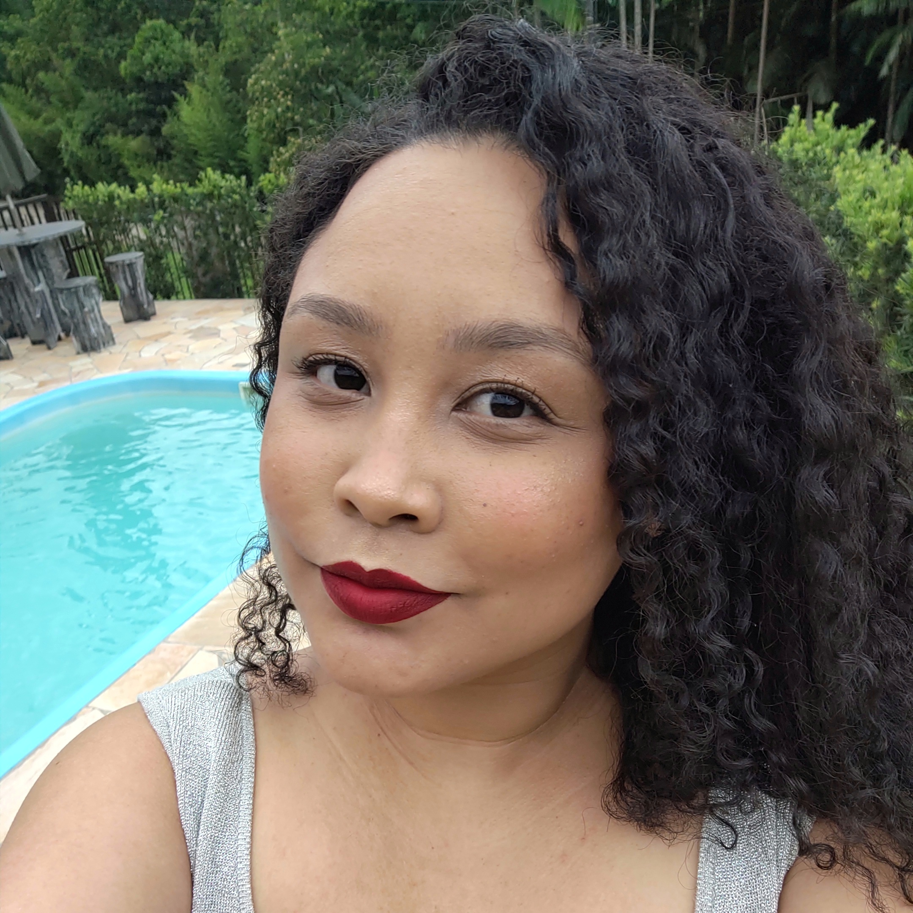
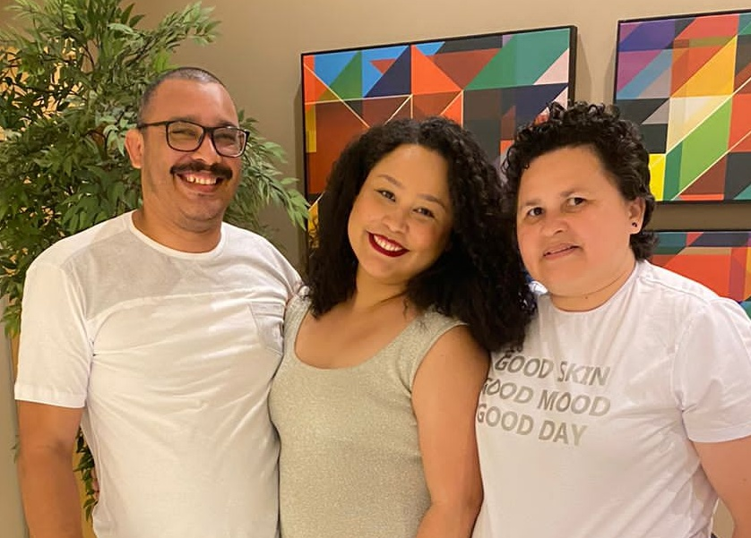
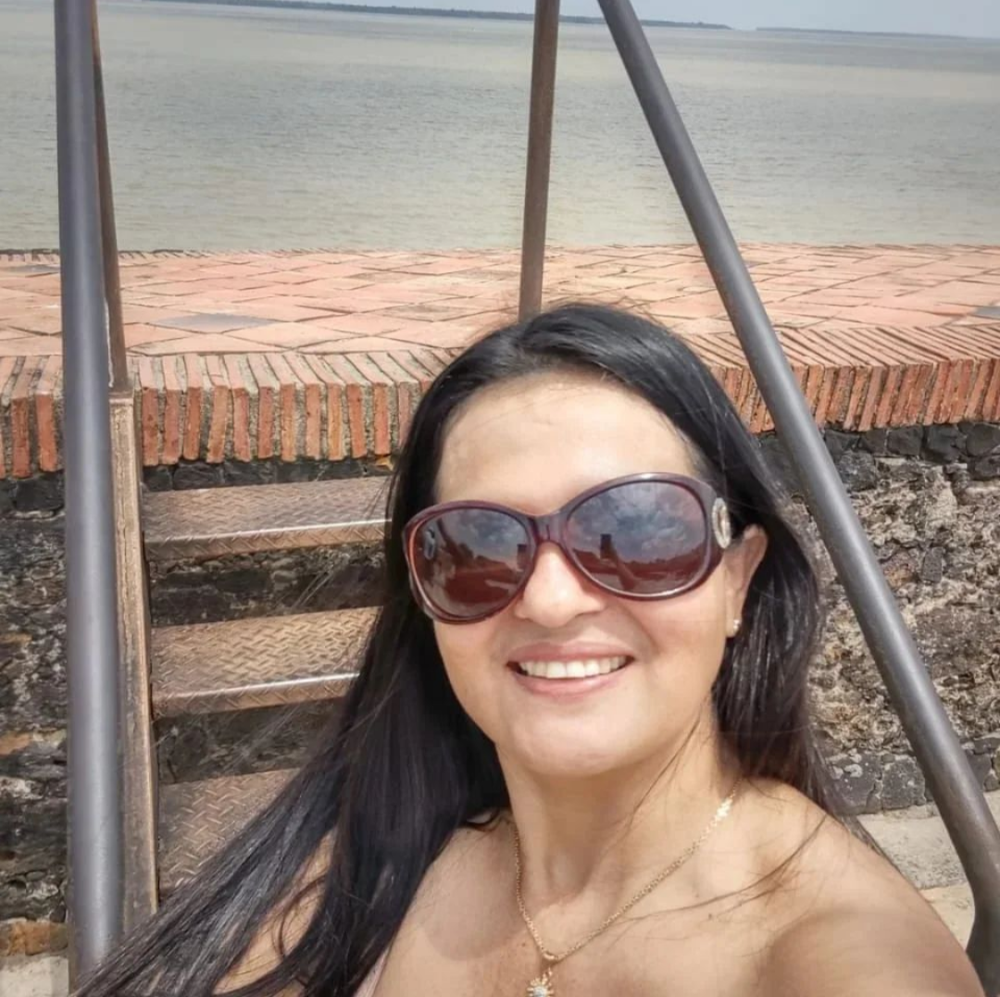

# Infância e ensino fundamental: Amanda Segundo

*"Talvez os softwares me escolheram quando eu era apenas uma criança."*

*Amanda Segundo*



## Informações básicas

- **Nome**: Amanda Segundo
- **Idade**: 27
- **Idade Real**: 6
- **Aniversário**: 29 de fevereiro
- **Ensino Médio**: Integrado à Informática na Escola Técnica Juscelino Kubitschek de Oliveira
- **Ensino Superior**: Análise e Desenvolvimento de Sistemas no Instituto Federal Catarinense
- **Pós Graduação**: Engenharia de Software na Universidade Tecnológica Federal do Paraná
- **Emprego Atual**: Engenheira de Software no Banco Neon
- **Trechos de Código**: Fundadora e Administradora
- **Data da fundação da Trechos de Código**: 11 de agosto de 2019

### Algoritmo do ano bissexto

#### Linguagem C#

```cs
string input = Console.ReadLine();
int ano = int.Parse(input); 

if ((ano % 400 == 0) || ((ano % 4 == 0) && (ano % 100 != 0)))
{
    Console.WriteLine($"O ano de {ano} é um ano Bissexto.");
}
else
{
    Console.WriteLine($"O ano de {ano} não é um ano Bissexto.");
}
```

💡[Ano Bissexto](https://pt.wikipedia.org/wiki/Ano_bissexto)

## Origem

[Brasil](https://pt.wikipedia.org/wiki/Brasil) > [Amazônia](https://pt.m.wikipedia.org/wiki/Amaz%C3%B4nia) > [Região Norte](https://pt.m.wikipedia.org/wiki/Regi%C3%A3o_Norte_do_Brasil) > [Estado do Pará](https://pt.m.wikipedia.org/wiki/Par%C3%A1) > [Região Metropolitana de Belém](https://pt.m.wikipedia.org/wiki/Regi%C3%A3o_Metropolitana_de_Bel%C3%A9m) > [Município de Benevides](https://pt.m.wikipedia.org/wiki/Benevides) > [Benfica](https://www.instagram.com/benfica_pa)

Minha origem é de uma família pobre, nunca passei fome, mas, sempre tive o mínimo de conforto. Algumas vezes melhoramos nossas condições de vida e outras vezes decaímos, enquanto morávamos no Pará.



Minha mamãe Jane Segundo me ensinou a ser amorosa, sociável e sempre a acreditar em mim.
Meu papai [Elley Segundo](https://www.linkedin.com/in/elleysegundo/) me ensinou a ser estudiosa e persistente.

## Localização atual

[Região Sul](https://pt.m.wikipedia.org/wiki/Regi%C3%A3o_Sul_do_Brasil) > [Santa Catarina](https://pt.m.wikipedia.org/wiki/Santa_Catarina) > [Blumenau](https://pt.m.wikipedia.org/wiki/Blumenau)


Escolhi morar em Blumenau pelas oportunidades na área de Tecnologia, pela qualidade de vida, pela segurança e por admirar a cultura alemã.

## Infância

### Primeiro contato com tecnologia e amor por softwares

#### Simone Mendes (tia)

Comecei a ler, a escrever e a fazer cálculos matemáticos com quatro anos de idade. 

Minha tia Simone começou a me apresentar celulares no ano de 2000, ela trabalhava muito para conseguí-los, assim comecei meu fascínio por softwares, em celulares.

Ela me apresentou celulares até o ano de 2010, depois disso minha mãe conseguiu comprar meu primeiro celular.



Hoje a minha tia é blogueira no [TikTok](https://www.tiktok.com/@simone89mendes87).

Primeiro celular da tia Simone:


Outro celular dela:


💡[Smartphone](https://pt.m.wikipedia.org/wiki/Smartphone)

### Primeiros contatos com computadores

#### Garagem de ônibus onde o papai trabalhava

Ele me levou para passar um dia no trabalho dele onde exercia o papel de almoxarife, basicamente joguei Pinball, Paciência e fiz alguns desenhos no Paint.

💡[Computador](https://pt.m.wikipedia.org/wiki/Computador)

#### Escola de informática Universo

Fiz um curso de informática básica na [Escola Universo Informática](https://www.facebook.com/universoinformatica.will) localizada em Benfica, esta escola é dos meus tios Will e Edilene.

💡[Informática](https://pt.wikipedia.org/wiki/Inform%C3%A1tica)

#### Laboratório de informática top de linha em uma escola em Benfica

Minha prima [Éula Nóbrega](https://lattes.cnpq.br/8802195980189053) e sua amiga [Maysa Alves](https://www.linkedin.com/in/maysaalves) me levaram em uma escola que possuía um laboratório de informática top de linha, elas foram digitar um trabalho no Word e estavam com um disquete.

💡[Word](https://pt.wikipedia.org/wiki/Microsoft_Word)

💡[Disquete](https://pt.wikipedia.org/wiki/Disquete)

#### Trabalho com restauração e montagens de fotos com Photoshop

Trabalhei com meu pai onde eu fazia restaurações e montagens de fotos, aprendi lendo os tutoriais do [Fabio Lody](https://www.linkedin.com/in/fabiolody/) que na época trabalhava no [iMasters](https://imasters.com.br/).

💡[Photoshop](https://pt.wikipedia.org/wiki/Adobe_Photoshop)

#### CRAS Murinin

Fiz um curso de informática no [CRAS do Murinin](https://www.facebook.com/cras.murinin.1), lá eu pude desenvolver meus conhecimentos em planilhas.

💡[Planilha](https://pt.wikipedia.org/wiki/Planilha_eletr%C3%B4nica)

### Oitava série
Estudei em uma escola de informática no município de Marituba que se chamava Software Cursos Profissionais, em seguida me tornei uma professora estagiária por 3 meses.

💡[Município de Marituba](https://pt.wikipedia.org/wiki/Marituba)

#### Amigas nerds

##### [Débora Araújo](https://www.instagram.com/psico_deboraaraujo/)

Hoje a Débora é Pedagoga, Psicopedagoga, Psicoterapeuta e Acadêmica de Neuropsicopedagogia.

💡 Conheça o trabalho da Débora neste [podcast](https://www.youtube.com/live/stgVmm4wsxE?si=OZkkqKWhwyNiJwGA).

##### [Bianca Carvalho](https://www.linkedin.com/in/bianca-carvalho-b45593204/)

💡 [Nerd](https://pt.m.wikipedia.org/wiki/Nerd)

### Gostou da Live?

☕️ Compre um café para mim:

PIX: d29ce6e0-7c0d-4fc2-ab12-3f8e1815258a